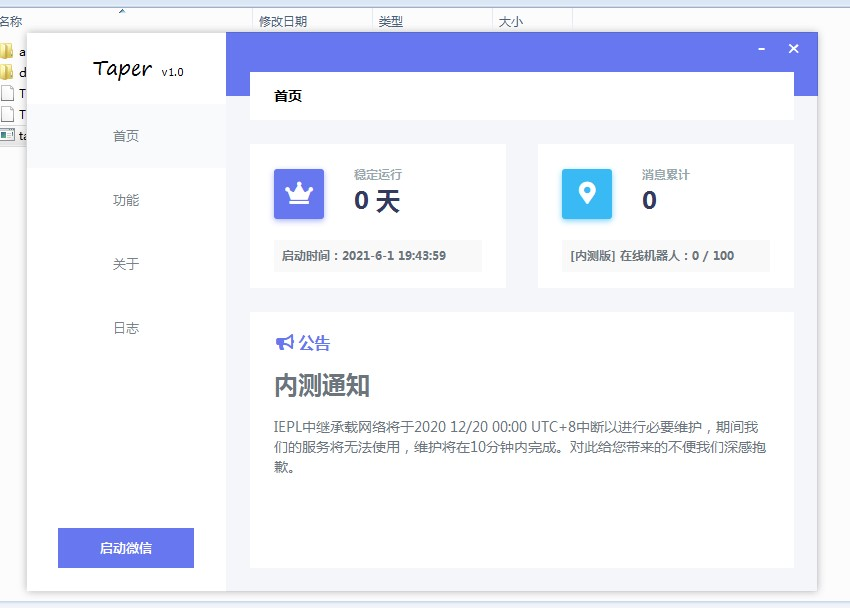
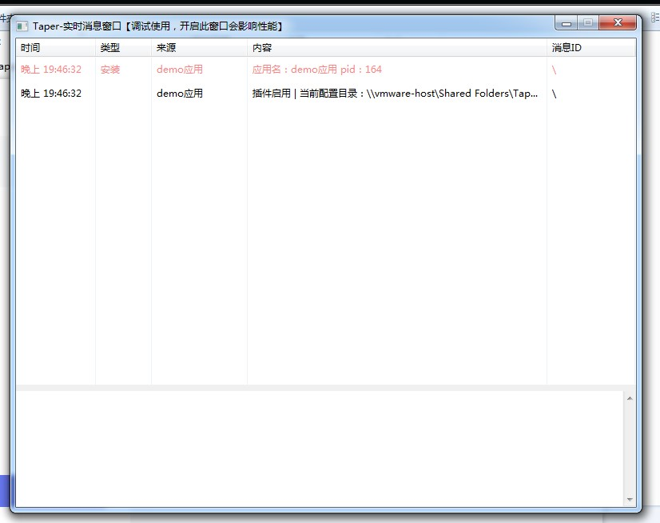

## 前言

**该项目是本人以学习为目的开发的一款可拓展式微信机器人框架，参考了可爱猫的插件设计思路，在此特别感谢可爱猫，给了我很大的启发。语言选用了C++的原因是考虑到易语言的内存优化问题和稳定性，所以只用易语言做界面，个人感觉效果还是不错的，起码内存占用确定很小了=.=，因为个人精力有限，所以就开源欢迎大家一起学习探讨，整体框架已经基本完成，菜鸟作品，大佬轻喷，欢迎有想法能继续维护的道友们联系我~**

----

## 介绍

**Taper是一款可由开发者自主开发插件的可拓展微信机器人框架，采用多进程模式，保证了每个插件的沙盒性；TCP进行进程间通信，保证了数据传输的可靠性，采用C++语言作为核心模块的开发，保证了程序的内存占用更低更高效更稳定，目前整体框架架构已经完成，微信功能只完成了必要的功能，目前程序还有很多不知道的BUG，欢迎大佬们进行指点，也欢迎大家一起学习交流~**

## 目录结构

- app *插件目录*
    - demo.tap.dll *演示插件*
    - demo.tap.e *演示插件源码*
    - sdk.e *插件sdk模块源码*
    - TapSDK模块v1.0.ec *插件sdk模块*
- data
    - bin
        - layout.dll *界面dll，由e编写*
        - layout.e *界面dll源码*
        - tap.dll *微信注入dll*
        - HPSocket4C.dll *HP模块*
        - Taper *tap.dll和taper.exe源码，VS2019工程项目*
    - temp *缓存目录*
- img *项目演示图片目录，可以删除*
- Taper.exe *主程序*

## 版本要求
**编译环境为VS2019 只支持微信3.2.1.127版本。附上3.2.1.127微信版本的安装包**

https://wwe.lanzoui.com/b01oc5ifg 密码:dpoo

## 项目截图

## 声明

**本项目仅供技术研究，请勿用于任何商业用途，请勿用于非法用途，如有任何人凭此做何非法事情，均于作者无关，特此声明。**